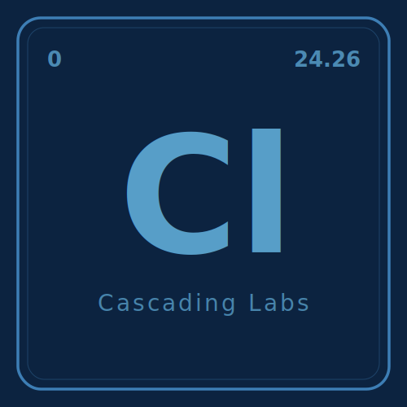

<p align="center">
  <a href="https://cascadinglabs.com">
    <picture>
      <source media="(prefers-color-scheme: dark)" srcset="media/logo-dark.svg">
      <source media="(prefers-color-scheme: light)" srcset="media/logo-light.svg">
      
    </picture>
  </a>
</p>

<p align="center">
  <a href="https://discord.gg/w6bVujKphH"></a>
  <a href="https://opensource.org/licenses/Apache-2.0"></a>
</p>

# Cascading Labs

Company website and documentation hub — [cascadinglabs.com](https://cascadinglabs.com)

Built with [Astro](https://astro.build/) and [Starlight](https://starlight.astro.build/) for documentation. Hosts product pages and project docs for the Cascading Labs ecosystem.

## Projects

- **[Yosoi](https://cascadinglabs.com/yosoi)** — AI-powered selector discovery for web scraping
- **[VoidCrawl](https://cascadinglabs.com/voidcrawl/)** — Rust-native CDP browser automation for Python
- **[QScrape](https://qscrape.dev)** — Web scraper evaluation suite

## Development

```bash
bun install
bun run dev       # http://localhost:4321
bun run build
bun run preview
```

## Lint

```bash
bun run check     # biome check + autofix
bun run lint      # biome lint only
bun run format    # biome format
```

## License

Apache-2.0
